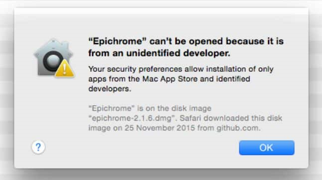
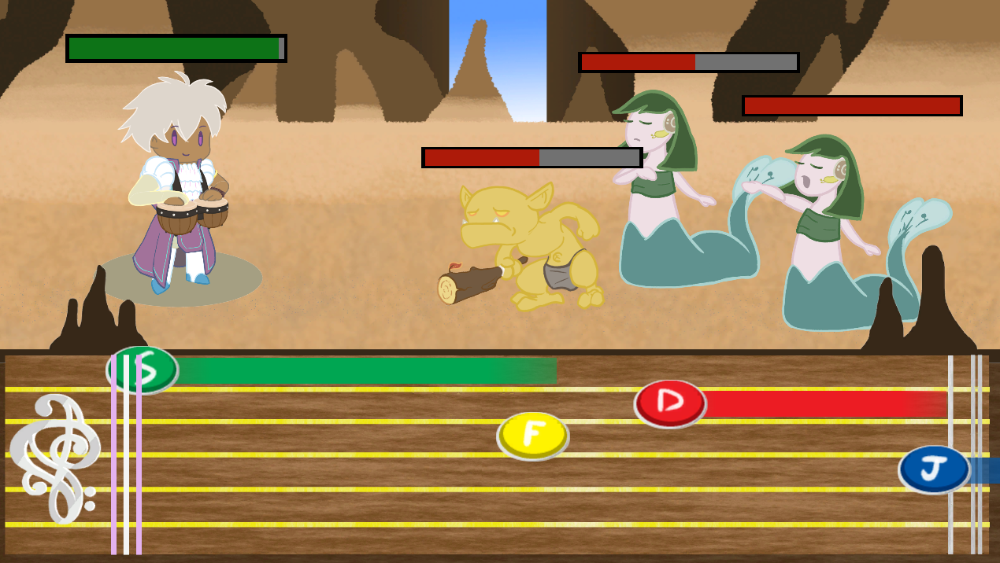

# OneBardBand-DesktopBuilds
 Stores the current PC/Mac/Linux builds for One Bard Band

 ### **Instructions for downloading and running:**
 <ol>
 <li>Download zip file pertaining to your Operating System</li>
 <li>Extract zip folder</li>
 <li>Running the application:</li>
    <ul>
    <li>For Mac, extracting from the zip folder should simply give you the application itself. If attempting to run the application gives you an error like this:
     
    Right-click (or Control + click) on the application, and select "Open" from the context menu. You will get a similar pop up, but this time with an option to Open the application regardless. Have fun!</li>
    <li>For Windows (32-bit & 64-bit) and Linux, extracting the zip folder should give you a regular folder of the same name. Open that folder and run the “One Bard Band” Application (for Windows it’s the .exe file, and for Linux it’s the x86_64 file). Have fun!</li>
    </ul>
</ol>

### **Controls:**

#### *In the Overworld*

<ul>
<li>WASD : Movement</li>
    <ul>
    <li>W : move up</li>
    <li>A : move left</li>
    <li>S: move down</li>
    <li>D: move right</li>
    </ul>
<li>Escape Key : Toggle Pause Menu</li>
</ul>

#### *In Battle*

For battle, we recommend placing your hands on the keyboard in traditional typing position, with your index fingers resting on the F and J keys.

When a note reaches the red/pink bar on the left, press the corresponding key to play the note and attack! You'll take damage for any notes you miss! Some Pan Flute notes have a colored bar trailing behind them, meaning the notes are sustained. Press and hold the key to continue paying the note for it's full duration.
<ul>
<li>Playing Bongos:</li>
    <ul>
    <li>C: Hit High Bongo</li>
    <li>M: Hit Low Bongo</li>
    </ul>
<li>Playing Pan Flute</li>
    <ul>
    <li>S: Play Pan Flute S</li>
    <li>D: Play Pan Flute D</li>
    <li>F: Play Pan Flute F</li>
    <li>J: Play Pan Flute J</li>
    <li>K: Play Pan Flute K</li>
    <li>L: Play Pan Flute L</li>
    </ul>
