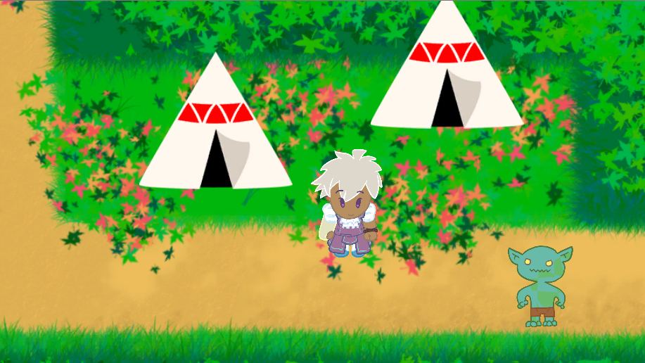

# OneBardBand-DesktopBuilds
 Stores the current PC/Mac/Linux builds for One Bard Band

 ### **Instructions for downloading and running:**
 <ol>
 <li>Download zip file pertaining to your Operating System</li>
 <li>Extract zip folder</li>
 <li>Running the application:</li>
    <ul>
    <li>For Mac, extracting from the zip folder should simply give you the application itself. If attempting to run the application gives you an error like this:
    
    Right-click (or Control + click) on the application, and select "Open" from the context menu. You will get a similar pop up, but this time with an option to Open the application regardless. Have fun!</li>
    <li>For Windows (32-bit & 64-bit) and Linux, extracting the zip folder should give you a regular folder of the same name. Open that folder and run the “One Bard Band” Application (for Windows it’s the .exe file, and for Linux it’s the x86_64 file). Have fun!</li>
    </ul>
</ol>

### **Controls:**

#### *In the Overworld*

| Key | Action            |
|-----|-------------------|
| W   | Move Up  |
| A   | Move Left   |
| S   | Move Down  |
| D   | Move Right  |
|   |   |
| Esc | Toggle Pause Menu |

#### *In Battle*

For battle, we recommend placing your hands on the keyboard in traditional typing position, with your index fingers resting on the F and J keys.

When a note reaches the three vertical bars on the left, press the corresponding key to play the note and attack! You'll take damage for any notes you miss! Some Pan Flute notes have a colored bar trailing behind them, meaning the notes are sustained. Press and hold the key to continue playing the note for it's full duration and deal bonus damage (or gain bonus health over time).

| Key | Action            |
|-----|-------------------|
| C   | Play High Bongo   |
| M   | Play Low Bongo    |
|   |   |
| S   | Play Pan Flute S  |
| D   | Play Pan Flute D  |
| F   | Play Pan Flute F  |
| J   | Play Pan Flute J  |
| K   | Play Pan Flute K  |
| L   | Play Pan Flute L  |
|   |   |
| Esc | Toggle Pause Menu |
